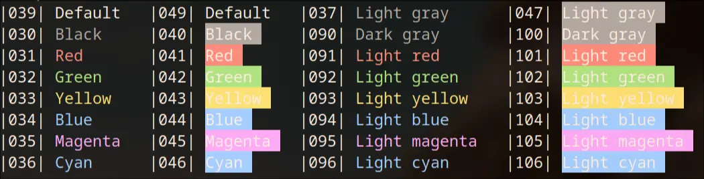
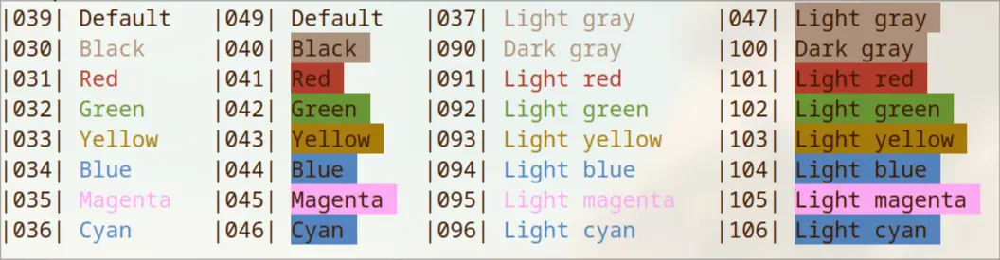

<div align="center">


### Whiskers for [Alacritty](https://github.com/alacritty/alacritty)

<div>
    
    
</div>
</div>

## 👷‍♂️ Install

- Clone the repository into the config directory:
```sh
mkdir -p ~/.config/alacritty/themes/whiskers/
git clone https://github.com/Whiskers-Color-Scheme/alacritty ~/.config/alacritty/themes/whiskers/ 
```

- Add the import at the beggining of the alacritty config file. Replace {theme} with "panther" or "tiger" accordingly:
```
import = [
    "~/.config/alacritty/themes/whiskers/{theme}.toml"
]
```

## 💻 Maintainers

- [lighttigerXIV](https://github.com/lighttigerxiv)